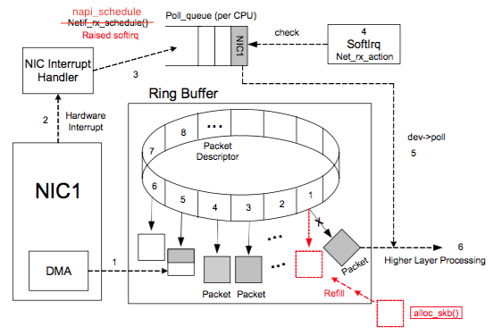
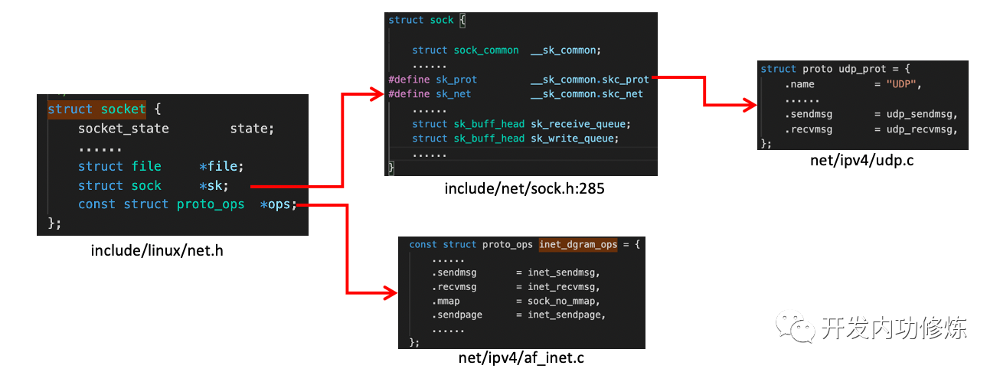

### 第2章-内核是如何接收网络包的

#### 创建ksoftirqd内核线程
```
// kernel/softirq.c
struct smp_hotplug_thread softirq_threads = {
	.store              = &ksoftirqd,
	.thread_should_run  = ksoftirqd_should_run,
	.thread_fn          = run_ksoftirqd,
	.thread_comm        = "ksoftirqd/%u",
}

early_initcall(spawn_ksoftirqd)
|-spawn_ksoftirqd(void)
  |-smpboot_register_percpu_thread(&softirq_threads)
```

#### 网络子系统初始化
```
// net/core/dev.c
subsys_initcall(net_dev_init);
|-net_dev_init(void)
  |-open_softirq(NET_RX_SOFTIRQ, net_rx_action)

open_softirq为每一种软中断注册处理函数
```

#### 协议栈注册
```
// net/ipv4/af_inet.c
fs_initcall(inet_init)
|-inet_init(void)
  |-inet_add_protocol(&udp_protocol, IPPROTO_UDP) // 注册udp协议
  |-inet_add_protocol(&tcp_protocol, IPPROTO_TCP) // 注册tcp协议
  |-dev_add_pack(&ip_packet_type)                 // 注册ip协议

全局变量struct list_head ptype_base[16]
* 软中断会通过ptype_base找到ip协议的处理函数ip_rcv

全局变量struct net_protocol *inet_protos[256]
* ip_rcv()会通过inet_protos找到TCP的处理函数tcp_v4_rcv
```

#### 网卡驱动初始化和启用网卡
```
// drivers/net/ethernet/intel/e100.c
struct pci_driver e1000_driver = {
	.name     = e1000_driver_name,
	.id_table = e1000_pci_tbl,
	.probe    = e1000_probe,
	.remove   = e1000_remove
}
struct net_device_ops e1000_netdev_ops = {
	.ndo_open           = e1000_open,
	.ndo_stop           = e1000_close,
	.ndo_start_xmit     = e1000_xmit_frame,
	.ndo_get_stats      = e1000_get_stats,
	.ndo_set_rx_mode    = e1000_set_rx_mode,
	.ndo_set_mac_address= e1000_set_mac,
	.ndo_tx_timeout     = e1000_tx_timeout,
}
struct net_device_ops loopback_ops = {
	.ndo_init            = loopback_dev_init,
	.ndo_start_xmit      = loopback_xmit,
	.ndo_get_stats64     = loopback_get_stats64,
	.ndo_set_mac_address = eth_mac_addr,
};

module_init(e1000_init_module)
|-e1000_init_module(void)
  |-pci_register_driver(&e1000_driver)

pci_register_driver调用完成后，内核就知道了该驱动的相关信息，当硬件e1000网卡被识别后，就会调用该驱动的probe方法（e1000_probe）

int e1000_probe(struct pci_dev *pdev, struct pci_device_id *ent)
|-netdev->netdev_ops = &e1000_netdev_ops;
|-netif_napi_add(netdev, &adapter->napi, e1000_clean, 64) // 注册NAPI机制所必须的poll函数e1000_clean

在网卡被启动的时候(ifconfig eth0 up)会调用e1000_netdev_ops->ndo_open，即e1000_open

int e1000_open(struct net_device *netdev)
|-e1000_setup_all_tx_resources(adapter) // 设置传输的ringBuffer和描述符数组
|-e1000_setup_all_rx_resources(adapter) // 设置接收的ringBuffer和描述符数组
|-e1000_request_irq(adapter)            // 设置硬中断回调函数e1000_intr
  |-request_irq(adapter->pdev->irq, handler, irq_flags, netdev->name, netdev)
```

#### 硬中断
```
e1000_intr(int irq, void *data)
|-__napi_schedule(&adapter->napi)
  |-____napi_schedule(this_cpu_ptr(&softnet_data), n)
    |-list_add_tail(&napi->poll_list, &sd->poll_list) // 把adapter->napi->poll_list加入到cpu的softnet_data->poll_list
    |-__raise_softirq_irqoff(NET_RX_SOFTIRQ)          // 触发了一个软中断NET_RX_SOFTIRQ
      |-or_softirq_pending(1UL << nr)                 // 展开：this_cpu_or(irq_stat.__softirq_pending, (1 << nr))
```



#### 软中断
```
struct softirq_action softirq_vec[10] // 分别对应："HI", "TIMER", "NET_TX", "NET_RX", "BLOCK", "BLOCK_IOPOLL",
                                      //         "TASKLET", "SCHED", "HRTIMER", "RCU"

ksoftirqd_should_run(int cpu)
|-local_softirq_pending()     // 展开：this_cpu_read(irq_stat.__softirq_pending)

run_ksoftirqd(int cpu)
|-__do_softirq()
  |-h = softirq_vec
  |-h->action(h)

全局变量softirq_vec在“网络子系统初始化”中注册了NET_RX_SOFTIRQ对应的处理函数net_rx_action

net_rx_action(struct softirq_action *h)
|-n = list_first_entry(&list, struct napi_struct, poll_list)
|-napi_poll(n, &repoll)
  |-n->poll(n, weight)       // 调用NAPI机制的poll函数e1000_clean

e1000_clean(struct napi_struct *napi, int budget)
|-adapter->clean_rx(adapter, &adapter->rx_ring[0], &work_done, budget)
  |-e1000_clean_rx_irq(adapter, &adapter->rx_ring[0], &work_done, budget)
    |-e1000_receive_skb(adapter, status, rx_desc->special, skb)
      |-napi_gro_receive(&adapter->napi, skb)
        |-napi_skb_finish(dev_gro_receive(napi, skb), skb)
          |-netif_receive_skb_internal(skb)
            |-__netif_receive_skb(skb)
              |-__netif_receive_skb_core(skb, true)
                |-pt_prev->func(skb, skb->dev, pt_prev, orig_dev)

pt_prev->func()会调研协议层注册的函数ip_rcv或者arp_rcv
```

#### IP协议层处理
```
ip_rcv(skb, skb->dev, pt_prev, orig_dev)
|-NF_HOOK(NFPROTO_IPV4, NF_INET_PRE_ROUTING, net, NULL, skb, dev, NULL, ip_rcv_finish)
  |-ip_rcv_finish(net, NULL, skb)
    |-ip_route_input_noref(skb, iph->daddr, iph->saddr, iph->tos, skb->dev)
      |-ip_route_input_mc(skb, daddr, saddr, tos, dev, our)
        |-rth->dst.input = ip_mr_input
    |-dst_input(skb)
      |-skb_dst(skb)->input(skb)  // 这里调用ip_mr_input
        |-ip_mr_input(skb)
          |-ip_local_deliver(skb)
            |-NF_HOOK(NFPROTO_IPV4, NF_INET_LOCAL_IN, net, NULL, skb, skb->dev, NULL, ip_local_deliver_finish)
              |-ip_local_deliver_finish(net, NULL, skb)
                |-ipprot = rcu_dereference(inet_protos[protocol])
                |-ipprot->handler(skb)

inet_protos中保存着tcp_rcv()和udp_rcv()的函数地址，可以把包传给传输层
```

#### TCP协议层处理
```
tcp_v4_rcv(skb)
|-sk = __inet_lookup_skb(&tcp_hashinfo, skb, __tcp_hdrlen(th), th->source, th->dest)
|-tcp_v4_do_rcv(sk, skb)
  |-tcp_rcv_established(sk, skb, tcp_hdr(skb), skb->len)  // tcp是established状态
    |-tcp_queue_rcv(sk, skb, tcp_header_len, &fragstolen) // 把数据放在socket接收队列
    |-sk->sk_data_ready(sk)                               // 即sock_def_readable，唤醒等待队列上的进程
```

#### UDP协议层处理
```
udp_rcv(skb)
|-__udp4_lib_rcv(skb, &udp_table, IPPROTO_UDP)
  |-sk = __udp4_lib_lookup_skb(skb, uh->source, uh->dest, udptable) // 找到对应的socket
  |-udp_queue_rcv_skb(sk, skb)          
    |-__udp_queue_rcv_skb(sk, skb)           // 用户没有正在读sk
      |-sock_queue_rcv_skb(sk, skb)
        |-__skb_queue_tail(list, skb)        // 把数据放在socket接收队列
        |-sk->sk_data_ready(sk)              // 即sock_def_readable，唤醒等待队列上的进程
    |-sk_add_backlog(sk, skb, sk->sk_rcvbuf) // 用户正在读sk，放在backlog队列
```

#### recvfrom系统调用


```
struct socket的ops是协议的方法集合，tcp和udp的ops分别如下：
const struct proto_ops inet_stream_ops = {
    .sendmsg       = inet_sendmsg,
    .recvmsg       = inet_recvmsg,
}
const struct proto_ops inet_dgram_ops = {
    .sendmsg       = inet_sendmsg,
    .recvmsg       = inet_recvmsg,
}

struct socket的sk.sk_prot又定义了二级处理函数，UDP的sk_prot如下：
struct proto udp_prot = {
    .name          = "UDP",
    .owner         = THIS_MODULE,
    .close         = udp_lib_close,
    .connect       = ip4_datagram_connect,
    ...
    .sendmsg       = udp_sendmsg,
    .recvmsg       = udp_recvmsg,
    .sendpage      = udp_sendpage,
}

recvfrom系统调用流程如下：
SYSC_recvfrom()
|-sock_recvmsg(sock, &msg, iov_iter_count(&msg.msg_iter), flags)
  |-sock_recvmsg_nosec(sock, msg, size, flags)
    |-sock->ops->recvmsg(sock, msg, size, flags) // 这里即是inet_recvmsg
      |-inet_recvmsg(sock, msg, size, flags)
        |-sk->sk_prot->recvmsg(sk, msg, size, flags & MSG_DONTWAIT, flags & ~MSG_DONTWAIT, &addr_len)
          |-udp_recvmsg(sk, msg, size, noblock, flags, &addr_len)
            |-__skb_recv_datagram(sk, flags | (noblock ? MSG_DONTWAIT : 0), &peeked, &off, &err)
              |-__skb_try_recv_datagram(sk, flags, peeked, off, err, &last) // 有数据直接取
              |-__skb_wait_for_more_packets(sk, err, &timeo, last)          // 没数据，进程进入睡眠
```

