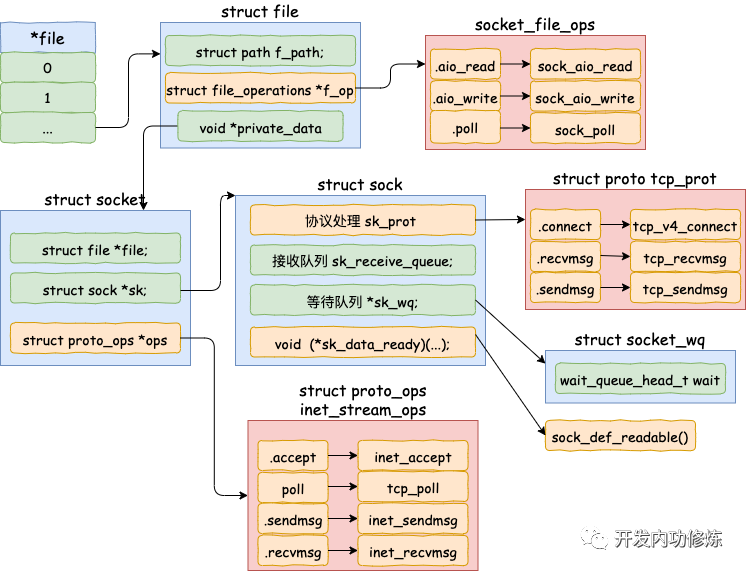
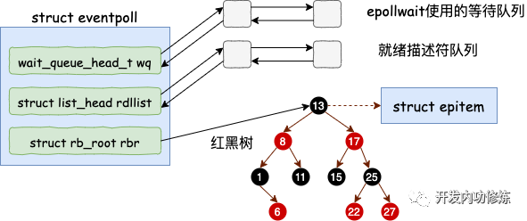

### 第3章-内核是如何与用户进程协作的

####  socket的直接创建
```
socket的系统调用如下
inet_create(struct net * net, struct socket * sock, int protocol, int kern) (\home\ubuntu\linux-4.6.2\net\ipv4\af_inet.c:263)
__sock_create(struct net * net, int family, int type, int protocol, struct socket ** res, int kern) (\home\ubuntu\linux-4.6.2\net\socket.c:1160)
sock_create(int family, int type, int protocol, struct socket ** res) (\home\ubuntu\linux-4.6.2\net\socket.c:1200)

socket(AF_INET, SOCK_DGRAM, 0)                      // 创建UDP的socket
|-SYSC_socket(family = 2, type = 2, protocol = 0)
  |-sock_create(family, type, protocol, &sock)
    |-__sock_create(net, family, type, protocol, res, 0)
      |-sock = sock_alloc()                         // 创建socket对象
      |-pf = rcu_dereference(net_families[family])  // 通过family获取对应的协议族
      |-pf->create(net, sock, protocol, kern)       // 调用协议族的create函数，即inet_create
        |-inet_create(net, sock, protocol, kern)
          |-sock->ops = answer->ops;                // 设置socket->ops
          |-answer_prot = answer->prot;             // answer_prot=udp_prot
          |-sk = sk_alloc(net, PF_INET, GFP_KERNEL, answer_prot, kern)  // 创建sk对象，并设置sk.sk_prot=answer_prot
          |-sock_init_data(sock, sk)
            |-sk->sk_data_ready	= sock_def_readable // 软中断收到数据包会调用此函数唤醒等待的进程
```

#### 内核和用户进程协作之阻塞方式
```
read(fd, buf, 1024)        // 读取tcp socket上的数据
|-SYSC_read(fd, buf, 1024)
  |-vfs_read(f.file, buf, count, &pos)
    |-__vfs_read(file, buf, count, pos)
      |-new_sync_read(file, buf, count, pos)
        |-filp->f_op->read_iter(&kiocb, &iter)
          |-sock_recvmsg(sock, &msg, iov_iter_count(to), msg.msg_flags)
            |-sock_recvmsg_nosec(sock, msg, size, flags)
              |-sock->ops->recvmsg(sock, msg, size, flags) // 这里即是inet_recvmsg
                |-inet_recvmsg(sock, msg, size, flags)
                  |-sk->sk_prot->recvmsg(sk, msg, size, flags & MSG_DONTWAIT, flags & ~MSG_DONTWAIT, &addr_len)
                    |-tcp_recvmsg(sk, msg, size, noblock, flags, &addr_len) 
                      |-sk_wait_data(sk, &timeo, last)     // 没有收到足够数据，阻塞当前进程

sk_wait_data是如何阻塞当前进程的
#define DEFINE_WAIT_FUNC(name,function) wait_queue_t name = { 
    .private = current, 
    .func = function, 
    .task_list = LIST_HEAD_INIT((name).task_list) 
}

sk_wait_data(sk, &timeo, skb)
|-DEFINE_WAIT(wait) // 展开为：DEFINE_WAIT_FUNC(wait, autoremove_wake_function)，创建一个等待对象wait
|-sk_sleep(sk)      // 获取当前socket的等待列表
|-prepare_to_wait(sk_sleep(sk), &wait, TASK_INTERRUPTIBLE) // 把wait插入等待列表
|-sk_wait_event(sk, timeo, condition)                      // 让出CPU，进程将进入睡眠状态
  |-schedule_timeout(timeo)
    |-schedule()
```

#### 软中断模块
```
tcp的软中断在tcp_v4_rcv后会执行tcp_queue_rcv和sock_def_readable
tcp_queue_rcv(sk, skb, tcp_header_len, &fragstolen)
|-__skb_queue_tail(&sk->sk_receive_queue, skb)      // 把skb放在sk的接收链表的尾部

sock_def_readable(sk)
|-wq = rcu_dereference(sk->sk_wq)                   // 获取sk->sk_wq
|-wake_up_interruptible_sync_poll(&wq->wait, key)   // 即__wake_up_sync_key
  |-__wake_up_sync_key(&wq->wait, mode=1, nr_exclusive=1, key)
    |-__wake_up_common(q, mode, nr_exclusive, wake_flags, key)
      |-curr->func(curr, mode, wake_flags, key)     // 在define DEFINE_WAIT语句中，curr->func设置为了autoremove_wake_function

autoremove_wake_function(wait, mode, sync, key)
|-default_wake_function(wait, mode, sync, key)
  |-try_to_wake_up(curr->private, mode, wake_flags) // 唤醒因为等待而被阻塞的进程
```

#### accept创建新socket


```
static const struct file_operations socket_file_ops = {
	.read_iter  = sock_read_iter,
	.write_iter = sock_write_iter,
	.poll       = sock_poll,
	.release    = sock_close,
};

SYSCALL_DEFINE4(accept4, int, fd, struct sockaddr __user *, upeer_sockaddr, int __user *, upeer_addrlen, int, flags)
|-sock = sockfd_lookup_light(fd, &err, &fput_needed)    // 通过fd找到监听的socket
|-newsock = sock_alloc()                                // 创建一个新的socket
|-newsock->type = sock->type
|-newsock->ops = sock->ops                              // 直接把监听的socket的ops方法赋值给新的socket
|-newfile = sock_alloc_file(newsock, flags, sock->sk->sk_prot_creator->name)
  |-alloc_file(&path, mod, &socket_file_ops)
    |-file->f_op = fop                                  // file.f_op即是socket_file_ops
|-sock->ops->accept(sock, newsock, sock->file->f_flags) // 即是inet_accept
  |-inet_accept(sock, newsock, sock->file->f_flags)
    |-sk1 = sock->sk
    |-sk1->sk_prot->accept(sk1, flags, &err)            // 即是inet_csk_accept
      |-inet_csk_accept(sk1, flags, &err)               
        |-reqsk_queue_remove(queue, sk1)                // 握手队列里直接获取创建好的sock
|-fd_install(newfd, newfile)                            // 把newfile加到当前进程的打开文件列表
```

#### epoll内核对象的创建


```
SYSCALL_DEFINE1(epoll_create1, int, flags)
|-ep_alloc(&ep)
  |-ep = kzalloc(sizeof(*ep), GFP_KERNEL)    // 申请ep的内存
  |-init_waitqueue_head(&ep->wq)             // 初始化等待队列
  |-INIT_LIST_HEAD(&ep->rdllist)             // 初始化就绪列表
  |-ep->rbr = RB_ROOT                        // 初始化红黑树指针   
```

#### epoll添加socket
```
SYSCALL_DEFINE4(epoll_ctl, int, epfd, int, op, int, fd, struct epoll_event __user *, event)
|-ep_insert(ep, &epds, tf.file, fd, full_check)
  |-epi = kmem_cache_alloc(epi_cache, GFP_KERNEL)    // 分配并初始化epitem
  |-epq.epi = epi
  |-init_poll_funcptr(&epq.pt, ep_ptable_queue_proc)
  |-ep_item_poll(epi, &epq.pt)                       // 设置回调是ep_poll_callback
    |-epi->ffd.file->f_op->poll(epi->ffd.file, pt)   // 即是sock_poll
      |-sock_poll(epi->ffd.file, pt)
        |-sock->ops->poll(file, sock, wait)          // 即是tcp_poll
          |-tcp_poll(file, sock, wait)
            |-sock_poll_wait(file, sk_sleep(sk), wait)
              |-poll_wait(filp, wait_address, p)
                |-p->_qproc(filp, wait_address, p)   // 即是ep_ptable_queue_proc
                  |-ep_ptable_queue_proc(filp, wait_address, p)
                    |-init_waitqueue_func_entry(&pwq->wait, ep_poll_callback) // 新建一个等待项，回调是ep_poll_callback
                    |-add_wait_queue(whead, &pwq->wait)                       // 插入sock的等待队列
  |-ep_rbtree_insert(ep, epi)                        // 插入红黑树
```

#### epoll_wait之等待接收
```
SYSCALL_DEFINE4(epoll_wait, int, epfd, struct epoll_event __user *, events, int, maxevents, int, timeout)
|-ep_poll(ep, events, maxevents, timeout)
  |-ep_events_available(ep)                               // 检查就绪队列上有没有事件就绪
  |-init_waitqueue_entry(&wait, current)                  // 没有就定义等待事件
    |-wait->func = default_wake_function
  |-__add_wait_queue_exclusive(&ep->wq, &wait)            // 把等待事件挂在ep->wq上
    |-__add_wait_queue(&ep->wq, &wait)
  |-schedule_hrtimeout_range(to, slack, HRTIMER_MODE_ABS) // 让出CPU，主动进入休眠
    |-schedule_hrtimeout_range_clock(expires, delta, mode, CLOCK_MONOTONIC)
      |-schedule()
        |-__schedule(false)
          |-context_switch(rq, prev, next)
  |-ep_send_events(ep, events, maxevents)                 // 休眠的进程被唤醒：transfer events to user space
```

#### 数据来了
```
硬中断->软中断->tcp_v4_rcv->sk->sk_data_ready(sk)，即sock_def_readable
sock_def_readable再执行curr->func(curr, mode, wake_flags, key)，这里的func在ep_insert时设置成了ep_poll_callback 

ep_poll_callback(wait_queue_t *wait, unsigned mode, int sync, void *key)
|-epi = ep_item_from_wait(wait)                          // 获取epitem
|-ep = epi->ep                                           // 获取对应的eventpoll结构体
|-list_add_tail(&epi->rdllink, &ep->rdllist)             // 把epitem加到eventpoll的就绪队列
|-if (waitqueue_active(&ep->wq)) wake_up_locked(&ep->wq) // 如果eventpoll等待队列有等待进程，唤醒它
  |-__wake_up_locked(&ep->wq, mode, nr)
    |--__wake_up_common(q, mode, nr, 0, NULL)
       |-curr->func(curr, mode, wake_flags, key)         // 这里的func在epoll_wait时被设置为default_wake_function

default_wake_function(curr, mode, wake_flags, key)
|-try_to_wake_up(curr->private, mode, wake_flags)        // 这里的curr->private就是休眠的进程
```


