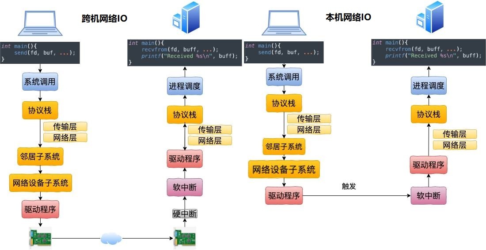

### 第5章-深度理解本机网络IO

#### 跨机网络IO和本机网络IO


#### 本机发送之网络层路由
```
网络层发送处理以ip_queue_xmit开始
（查看local的路由：ip route list table local）

ip_queue_xmit(sk, skb, &inet->cork.fl)
|-rt = ip_route_output_ports(net, fl4, sk, ...) 
  |-ip_route_output_flow(net, fl4, sk)
    |-__ip_route_output_key(net, flp4)
      |-__ip_route_output_key_hash(net, flp, -1)
        |-fib_lookup(net, fl4, &res, 0)
          |-fib_table_lookup(tb, flp, res, flags)  // tb是main表
          |-fib_table_lookup(tb, flp, res, flags)  // tb是local表，最终会找到loopback设备
```

#### 本机发送之网络设备子系统
```
网络设备子系统以dev_queue_xmit开始

dev_queue_xmit(skb)
|-__dev_queue_xmit(skb, NULL)
  |-txq = netdev_pick_tx(dev, skb, accel_priv)       // 网卡有多个发送队列，这里选择一个
  |-q = rcu_dereference_bh(txq->qdisc)               // 获取与队列相关联的排序规则
  |-dev_hard_start_xmit(skb, dev, txq, &rc)

dev_hard_start_xmit(skb, dev, txq, &ret)
|-xmit_one(skb, dev, txq, next != NULL)
  |-netdev_start_xmit(skb, dev, txq, more)
    |-ops = dev->netdev_ops
    |-ops->ndo_start_xmit(skb, dev)                  // 即是loopback_xmit

```

#### 本机发送之驱动程序
```
loopback_xmit(skb, dev)
|-netif_rx(skb)
  |-netif_rx_internal(skb)
    |-enqueue_to_backlog(skb, get_cpu(), &qtail)
      |-__skb_queue_tail(&sd->input_pkt_queue, skb)  // 把skb放在sd的接收链表的尾部
      |-____napi_schedule(sd, &sd->backlog)          // 触发软中断
```

#### 本机发送之本机接收过程
```
net_rx_action(struct softirq_action *h)
|-n = list_first_entry(&list, struct napi_struct, poll_list)
|-napi_poll(n, &repoll)
  |-n->poll(n, weight)       // 调用NAPI机制的poll函数process_backlog

process_backlog(napi, quota)
|-skb_queue_splice_tail_init(&sd->input_pkt_queue, &sd->process_queue) // 把sd的input_pkt_queue转到process_queue
|-skb = __skb_dequeue(&sd->process_queue)                              // 不停的从sd->process_queue取skb
  |-__netif_receive_skb(skb)                                           // 把skb送往协议栈
```


