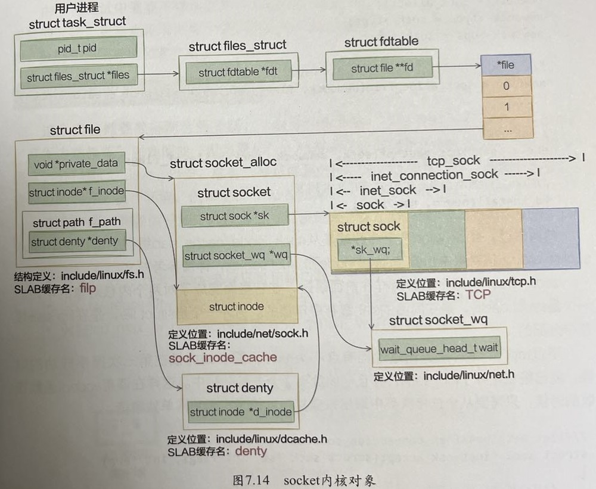
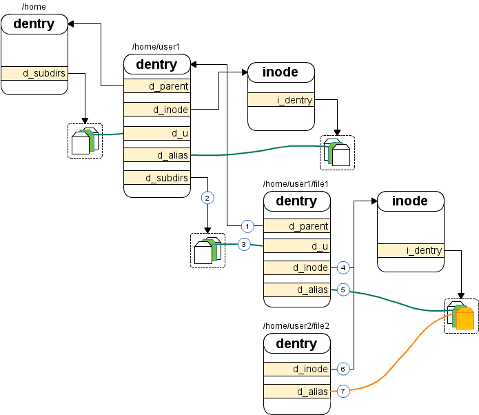

### 一条TCP连接消耗多大内存

#### Linux内核如何管理内存
```
常用命令：
1. 查看kmem cache：cat /proc/slabinfo
2. 查看kmem cache：slabtop
3. 查看kmem cache：cd linux-4.8/tools/vm && make slabinfo && ./slabinfo
4. 查看slab merging：cd linux-4.8/tools/vm && make slabinfo && ./slabinfo -a

查看CPU核数和NUMA内存：
1. cat /proc/cpuinfo | grep "processor"
2. dmidecode | grep "Socket Designation"
3. dmidecode | grep "Memory Device$" -A 5
4. numactl --hardware                     // 查看numa所有Node
5. cat /proc/zoneinfo | grep "^Node" -A 1 // 查看Node对应的Zone

内核如何管理内存：
每个CPU 对应一个Node
每个Node有若干个Zone：常见的是ZONE_DMA、ZONE_DMA32、ZONE_NORMAL
每个Zone用伙伴系统分配空闲页面:
struct zone {
    struct free_area free_area[11]; // 0~10分别是4K到4M
}

struct free_area {
    struct list_head free_list[4];  // 0~3分别是UNMOVABLE, MOVABLE, RECLAIMABLE, PCPTYPES
    unsigned long    nr_free;
};

slab分配器：
struct kmem_cache *kmem_cache_create(char *name, size_t size, size_t align, long flags, NULL)
             void *kmem_cache_alloc(struct kmem_cache *s, gfp_t gfpflags)
                   kmem_cache_free(struct kmem_cache *s, void *x)
```

#### TCP连接相关内核对象
```
socket(AF_INET, SOCK_STREAM, 0)                                        // 创建TCP的socket
|-SYSC_socket(family = 2, type = 1, protocol = 0)
  |-sock_create(family, type, protocol, &sock)
    |-__sock_create(..., family, type, protocol, res, 0)
      |-sock = sock_alloc()
        |-inode = new_inode_pseudo(sock_mnt->mnt_sb)
          |-inode = alloc_inode(sb)
            |-inode = sb->s_op->alloc_inode(sb)                        // 即是sock_alloc_inode
              |-inode = sock_alloc_inode(sb)
                |-ei = kmem_cache_alloc(sock_inode_cachep, GFP_KERNEL) // 申请内存struct socket_alloc
                |-wq = kmalloc(sizeof(*wq), GFP_KERNEL)                // 申请内存struct socket_wq
      |-pf->create(net, sock, protocol, kern)                          // 即是inet_create
        |-inet_create(net, sock, protocol, kern)
          |-sk = sk_alloc(net, PF_INET, GFP_KERNEL, answer_prot, kern) 
            |-sk = sk_prot_alloc(prot, priority, family) 
              |-sk = kmem_cache_alloc(slab, priority);                 // 申请内存struct sock 
  |-sock_map_fd(sock, flags)
    |-sock_alloc_file(sock, flags, NULL)
      |-dentry = d_alloc_pseudo(sock_mnt->mnt_sb, &name)
        |-dentry = __d_alloc(sb, name)
          |-dentry = kmem_cache_alloc(dentry_cache, GFP_KERNEL)        // 申请内存struct dentry
      |-file = alloc_file(&path, mode, &socket_file_ops)
        |-file = get_empty_filp()
          |-file = kmem_cache_zalloc(filp_cachep, GFP_KERNEL)          // 申请内存struct file
```

| 结构体 | 大小 | slab名 |
| --- | --- | --- |
| struct sock | 1.92K | TCP |
| struct socket_alloc | 0.63K | sock_inode_cache |
| struct dentry | 0.19K | dentry |
| struct file   | 0.25K | flip |
| struct socket_wq | 0.06K | kmalloc-64 |

#### socket内核对象
* [dentry和inode的关系](https://blog.csdn.net/jinking01/article/details/105682389)





```
dentry 就是目录项，保存着诸如文件名、路径等信息
inode 就是索引节点，保存具体文件的数据，比如权限、修改日期、设备号等等
（1）/home/user1 目录项中有一个双向链表 d_subdirs，里面链接着 /home/user1/file1 的目录项
（2）/home/user1/file1 目录项里的 d_u 也加入到了这个链表
（3）这样一个文件上下关系就建立起来了。同样，/home/user1 的 d_parent 将指向它的父目录 /home，并且将自己的 d_u 链接到 /home 的 d_subdirs。file1 的目录项中有一个 d_inode 指针，指向一个 inode 结构
（4）这个就是该文件的索引节点了，并且 file1 目录项里的 d_alias 也加入到了 inode 的链表 i_dentry 中
（5）这样 dentry 和 inode 的关系也建立起来了。前面讲过，如果一个文件的硬连接不止一个的话就会有多个 dentry 与 inode 相关联，请看图中 /home/user2/file2，它和 file1 互为硬链接。和 file1 一样，file2 也把自己的 d_inode 指向这个 inode 结构
（6）并且把 d_alias 加入到了 inode 的链表 i_dentry 里
（7）这样无论是通过 /home/user1/file1 还是 /home/user2/file2，访问的都是同一个文件。
```

#### 非ESTABLISH状态的内存开销
* FIN_WAIT2和TIME_WAIT状态下的TCP连接占用的内存约0.4K
* 此时dentry、flip、sock_inode_cache、TCP已被回收，多了一个0.25K的tw_sock_TCP


