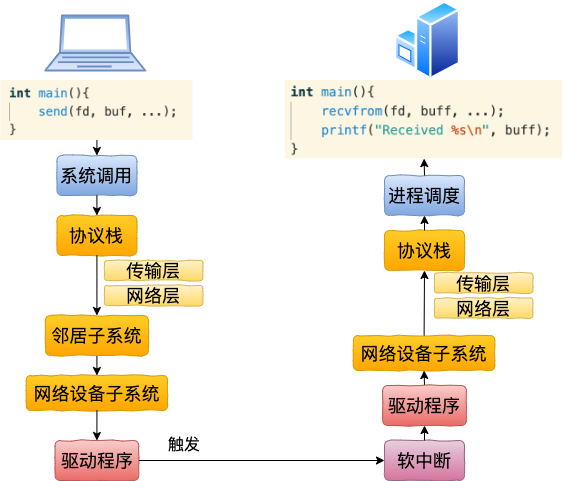
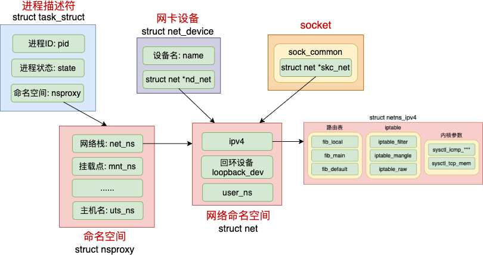
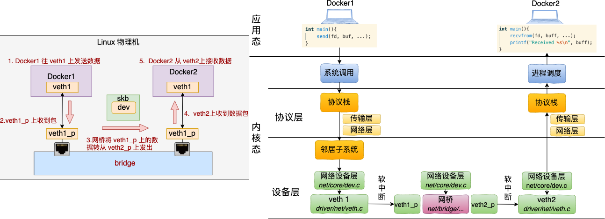

### 容器网络虚拟化

#### veth设备对(veth1->veth2)


```
配置命令：
ip netns add net1
ip link add veth1 type veth peer name veth2
ip link set veth1 netns net1
ip netns exec net1 ip addr add 192.168.0.101/24 dev veth1
ip netns exec net1 ip link set veth1 up
ip addr add 192.168.0.102/24 dev veth2
ip link set veth2 up

send系统调用
SyS_sendto(long fd, long buff, long len, long flags, long addr, long addr_len) (linux-4.6.2\net\socket.c:1616)
|-SYSC_sendto(int fd, void * buff, size_t len, unsigned int flags, struct sockaddr * addr, int addr_len) (linux-4.6.2\net\socket.c:1648)
  |-sock_sendmsg(struct socket * sock, struct msghdr * msg) (linux-4.6.2\net\socket.c:622)
    |-sock_sendmsg_nosec() (linux-4.6.2\net\socket.c:612)
      |-sock->ops->sendmsg(sock, msg, msg_data_left(msg)) // 即是AF_INET协议族的inet_sendmsg
        |-inet_sendmsg(struct socket * sock, struct msghdr * msg, size_t size) (linux-4.6.2\net\ipv4\af_inet.c:740)
          |-sk->sk_prot->sendmsg(sk, msg, size)           // 对应的方法是raw_sendmsg

网络层：
raw_sendmsg(struct sock * sk, struct msghdr * msg, size_t len) (linux-4.6.2\net\ipv4\raw.c:655)
|-ip_push_pending_frames(struct sock * sk, struct flowi4 * fl4) (linux-4.6.2\net\ipv4\ip_output.c:1460)
  |-ip_send_skb(struct net * net, struct sk_buff * skb) (linux-4.6.2\net\ipv4\ip_output.c:1440)
    |-ip_local_out(struct net * net, struct sock * sk, struct sk_buff * skb) (linux-4.6.2\net\ipv4\ip_output.c:112)
      |-dst_output() (linux-4.6.2\include\net\dst.h:504)
        |-ip_output(struct net * net, struct sock * sk, struct sk_buff * skb) (linux-4.6.2\net\ipv4\ip_output.c:355)
          |-NF_HOOK_COND() (linux-4.6.2\include\linux\netfilter.h:233)
            |-ip_finish_output(struct net * net, struct sock * sk, struct sk_buff * skb) (linux-4.6.2\net\ipv4\ip_output.c:281)
              |-ip_finish_output2(struct net * net, struct sock * sk, struct sk_buff * skb) (linux-4.6.2\net\ipv4\ip_output.c:206)
                |-dst_neigh_output(struct dst_entry * dst, struct neighbour * n, struct sk_buff * skb) (linux-4.6.2\include\net\dst.h:467)

邻居子系统：
dst_neigh_output(dst, neigh, skb)
|-n->output(n, skb)                                  // 即是neigh_resolve_output
  |-neigh_resolve_output(neigh, skb)        
    |-dev_queue_xmit(struct sk_buff * skb) (linux-4.6.2\net\core\dev.c:3394)

网络设备子系统
dev_queue_xmit(struct sk_buff * skb) (linux-4.6.2\net\core\dev.c:3394)
|-__dev_queue_xmit(struct sk_buff * skb, void * accel_priv) (linux-4.6.2\net\core\dev.c:3360)
  |-dev_hard_start_xmit(struct sk_buff * first, struct net_device * dev, struct netdev_queue * txq, int * ret) (linux-4.6.2\net\core\dev.c:2888)
    |-xmit_one(struct sk_buff * skb, struct net_device * dev, struct netdev_queue * txq, bool more) (linux-4.6.2\net\core\dev.c:2871)
      |-netdev_start_xmit() (linux-4.6.2\include\linux\netdevice.h:3937)
        |-__netdev_start_xmit() (linux-4.6.2\include\linux\netdevice.h:3928)
          |-ops->ndo_start_xmit(skb, dev)                  // 即是loopback_xmit

驱动程序
struct net_device_ops veth_netdev_ops = {
	.ndo_init            = veth_dev_init,
	.ndo_open            = veth_open,
	.ndo_stop            = veth_close,
	.ndo_start_xmit      = veth_xmit,
	.ndo_get_stats64     = veth_get_stats64,
	.ndo_set_mac_address = eth_mac_addr,
}
veth_xmit(struct sk_buff * skb, struct net_device * dev) (linux-4.6.2\drivers\net\veth.c:122)
|-dev_forward_skb(struct net_device * dev, struct sk_buff * skb) (linux-4.6.2\net\core\dev.c:1803)
  |-netif_rx_internal(struct sk_buff * skb) (linux-4.6.2\net\core\dev.c:3768)
    |-enqueue_to_backlog(struct sk_buff * skb, int cpu, unsigned int * qtail) (linux-4.6.2\net\core\dev.c:3725)
      |-____napi_schedule(struct softnet_data * sd, struct napi_struct * napi) (linux-4.6.2\net\core\dev.c:3419)

软中断->驱动程序->网络设备子系统->协议栈->进程调度和lo设备完全一样，省略。。。
```

#### 网络命名空间
* [彻底弄懂 Linux 网络命名空间](https://mp.weixin.qq.com/s/lscMpc5BWAEzjgYw6H0wBw)
* 网络namespace，简称netns。从逻辑上提供独立的网络协议栈，包括网络设备、路由表、arp表、iptables、socket等
* Linux上其它所有进程都是由1号进程派生出来的，1号进程使用默认的netns
* 创建进程时指定了CLONE_NEWNET标记位，那么该进程将会创建并使用新的netns
* 内核提供了三种操作命名空间的方式：clone、setns、unshare
  * ip netns add 命令使用的是unshare
  * [fork vfork clone学习](https://www.cnblogs.com/mysky007/p/12331200.html)
  * fork、pthread_creat、vfork的系统调用分别是sys_fork、sys_clone、sys_vfork、它们的底层都用的是do_fork
  * fork()是全部复制
  * vfork()是共享内存，方便调用exec执行其他程序，现在很少用
  * clone()是则可以将父进程资源有选择地复制给子进程



```
clone系统调用，并创建命名空间
SyS_clone(long clone_flags, long newsp, long parent_tidptr, long child_tidptr, long tls) (linux-4.6.2\kernel\fork.c:1834)
|-SYSC_clone() (linux-4.6.2\kernel\fork.c:1840)
  |-_do_fork(unsigned long clone_flags, unsigned long stack_start, unsigned long stack_size, int * parent_tidptr, int * child_tidptr, unsigned long tls) (linux-4.6.2\kernel\fork.c:1731)
    |-copy_process(unsigned long clone_flags, unsigned long stack_start, unsigned long stack_size, int * child_tidptr, struct pid * pid, int trace, unsigned long tls) (linux-4.6.2\kernel\fork.c:1459)
      |-copy_namespaces(unsigned long flags, struct task_struct * tsk) (linux-4.6.2\kernel\nsproxy.c:164)
        |-create_new_namespaces(unsigned long flags, struct task_struct * tsk, struct user_namespace * user_ns, struct fs_struct * new_fs) (linux-4.6.2\kernel\nsproxy.c:106)
          |-copy_net_ns(unsigned long flags, struct user_namespace * user_ns, struct net * old_net) (linux-4.6.2\net\core\net_namespace.c:360)
            |-if !(flags & CLONE_NEWNET) return get_net(old_net)  // 如果没有CLONE_NEWNET，直接返回父进程的netns
            |-setup_net(net, user_ns)                             // 设置新的netns
```

#### 虚拟交换机Bridge(veth1->br1->veth2)



```
配置命令：
ip netns add net1
ip link add veth1 type veth peer name veth1_p
ip link set veth1 netns net1
ip netns exec net1 ip addr add 192.168.0.101/24 dev veth1
ip netns exec net1 ip link set veth1 up

ip netns add net2
ip link add veth2 type veth peer name veth2_p
ip link set veth2 netns net2
ip netns exec net2 ip addr add 192.168.0.102/24 dev veth2
ip netns exec net2 ip link set veth2 up

brctl addbr br0
ip link set dev veth1_p master br0
ip link set dev veth2_p master br0
ip addr add 192.168.0.100/24 dev br0
ip link set veth1_p up
ip link set veth2_p up
ip link set br0 up

veth1->br1->veth2，前半部分(系统调用->协议栈->邻居子系统->网络设备层)和veth1->veth2一样，区别在于veth1_p处理软中断

软中断
net_rx_action(struct softirq_action *h)
|-n = list_first_entry(&list, struct napi_struct, poll_list)
|-napi_poll(n, &repoll)
  |-n->poll(n, weight)       // 调用NAPI机制的poll函数process_backlog

process_backlog(napi, quota)
|-__netif_receive_skb(skb)
  |-__netif_receive_skb_core(skb, false)
    |-rx_handler = rcu_dereference(skb->dev->rx_handler) // 这里br1在添加veth1_p时，设置了rx_handler
    |-rx_handler(&skb)                                   // 即是br_handle_frame
      |-NF_HOOK(NFPROTO_BRIDGE, NF_BR_PRE_ROUTING, dev_net(skb->dev), NULL, skb, skb->dev, NULL, br_handle_frame_finish)
        |-br_handle_frame_finish(net, sk, skb)
          |-br_forward(dst->dst, skb, skb2)
            |-__br_forward(to, skb)
              |-skb->dev = to->dev                       // 把skb的dev从veth1_p改成veth2_p
              |-NF_HOOK(NFPROTO_BRIDGE, NF_BR_FORWARD, dev_net(indev), NULL, skb, indev, skb->dev, br_forward_finish)
                |-br_forward_finish(net, sk, skb)
                  |-NF_HOOK(NFPROTO_BRIDGE, NF_BR_POST_ROUTING, net, sk, skb, NULL, skb->dev, br_dev_queue_push_xmit)
                    |-br_dev_queue_push_xmit(net, sk, skb)
                      |-dev_queue_xmit(skb)              // 向上层传递
```

#### 外部网络通信


