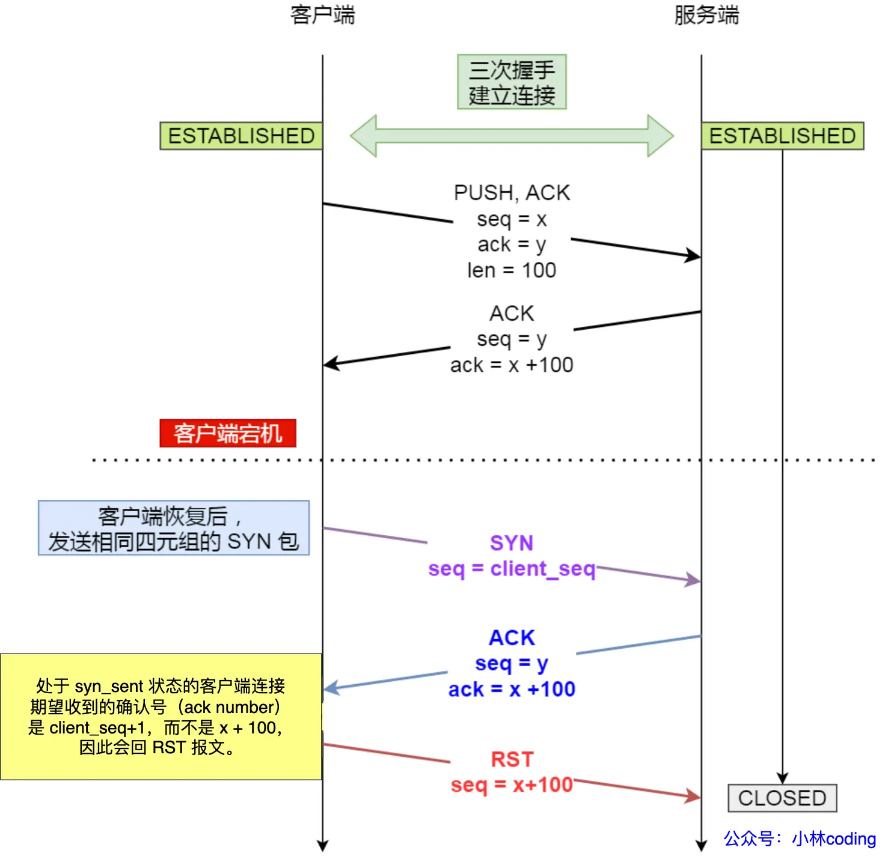

### 图解网络

#### 参考资料
* [图解网络](https://xiaolincoding.com/network/)

#### 2.2 键入网址到网页显示，期间发生了什么
* 域名DNS解析依次是：
  * 根 DNS 服务器（.）
  * 顶级域 DNS 服务器（.com）
  * 权威 DNS 服务器（server.com）
* 如果机器有多个网卡，需要通过路由表要确定使用哪张网卡和saddr：
  * `route -n`的字段：Destination、Gateway、Genmask、Iface
  * 将daddr和Genmask作与运算，看是否和Destination匹配，是则选取Iface
  * （若Destination和Genmask都是0.0.0.0，表示兜底策略）
  * （若Gateway是0.0.0.0，表示是二层网络，不需要网关）
* 网卡发包：dmac通过arp广播获取
* 交换机流程：
  * 收包后dmac在mac表已存在，根据mac表把包发给对应的设备
  * 收包后dmac在mac表不存在，把包发给所有设备，待设备回应后更新mac表
* 路由器-转发网关：A机器——X网关左手——X网关右手——B机器
  * A机->X左：macA机，ipA -> macX左，ipB
  * X左->X右：macX左，ipA -> macX右，ipB
  * X右->B机：macX右，ipA -> macB机，ipB
* 路由器-NAT网关：A机器——X网关——Y网关——B机器
  * A机->X关：macA机，ipA -> macX关，ipY
  * X关->Y关：macX关，ipX -> macY关，ipY
  * Y关->B机：macY关，ipY -> macB机，ipB
  * 其中A机器，ipA是它的内网ip，ipX是它的外网ip，B机器同理
  * 第二步中X网关把源ipA变成ipX的过程是SNAT：源地址转换
  * 第三步中Y网关把目标ipY变成ipB的过程是DNAT：目标地址转换

#### 2.3 linux网络是如何收发网络包的
* 发送TCP网络包，三次数据拷贝：
  * 进入内核态时，先拷贝为内核态的 sk_buff 内存
  * 传输层到网络层时，会拷贝一个副本 sk_buff，此副本在网卡发送成功后会释放掉
  * 传输层到网络层时，当收到ACK响应后，释放原始的 sk_buff
  * 当网络层发现 sk_buff 大于MTU时，还需要分片

#### 3.1 HTTP常见面试题
* 浏览器缓存
  * 根据Cache-Control，决定是否读本地缓存
  * 根据Etag发起请求（header头设置If-None-Match），如果是304则读本地缓存
* HTTP/1.1：有http-keepalive
* HTTP/2.0：
  * 头部压缩：相同header头只发一次
  * 二进制格式：header头和数据都是pb格式
  * 并发传输：每个请求分成若干个frame，但是有相同的streamId
  * 服务器主动推送资源
* HTTP/3.0：
  * 无队头阻塞：使用udp，避免tcp的队头阻塞问题
  * 更快的连接建立：tcp+tls是分层的，tcp三次握手+tls四次握手，而quic是一起的
  * 连接迁移：采用连接id而不是五元组，这样就算客户端ip变了，连接也没有断开

#### 4.1 TCP 三次握手与四次挥手面试题
* UDP头部有data的长度字段，TCP没有，TCP的data的长度计算方式如下：
  * ip包总长度 - ip头长度 - tcp头长度
  * （UDP其实也能这样算data的长度）
* TCP 和 UDP 可以使用同一个端口
* 第一次握手丢包后：假设net.ipv4.tcp_syn_retries=3
  * 第1次重传是在1秒后
  * 第2次重传是在2秒后
  * 第3次重传是在4秒后
  * 8秒后仍然没有收到ack则放弃
* 第二次握手丢包后，假设net.ipv4.tcp_synack_retries=3
  * 效果同上
* 第三次握手丢包后，不会重传包，因为客户端已经是ESTABLISH状态了
  * 此后客户端发送数据时，ack还是丢包的那个ack相同，服务端会自动建立好连接并接收数据
* 第一次挥手丢包后，假设tcp_orphan_retries=3
  * 效果同上，最后进入closed状态
* 第二次挥手丢包后，不会重传包，此时处于CLOSE_WAIT
  * 内核不会主动关闭连接，除非用户态调用了close
* 第三次挥手丢包后，假设tcp_orphan_retries=3
  * 服务端效果同上，最后进入closed状态
  * 客户端处于FIN_WAIT_2，等待tcp_fin_timeout秒关闭
* 第四次挥手丢包后，不会重传包，等待2MSL关闭
  * 2MSL = `#define TCP_TIMEWAIT_LEN` = 60秒

#### 4.2 TCP 超时重传、滑动窗口、流量控制、拥塞控制
* 超时重传-名词：
  * RTT：发送方发包到收到ack包的时间间隔
  * RTO：发送方发包丢包后多久重发包
  * `新的SRTT = (1 - α)·旧的SRTT + α·最新的RTT`
  * `RTO = SRTT + 4·rttvar`，其中rttvar表示SRTT与真实值的差距
  * linux的RTO初始值三次握手是1秒(写死在内核)，其他包是0.2秒(可调整)
* 超时重传-三种方案：假设序号2、3丢包
  * 快速重传：发送方收到三个重复序号2的ack。（问题是序号3也丢包了，也需要三次ack？）
  * SACK：ack包会告知哪个范围的包已经收到了
  * D-SACK：ack包会告知哪个范围的包被重复接收了
* 流量控制：
  * 接收方通过ack告知自己的窗口大小
  * （接收方可能会ack告知自己的窗口为0）
  * 窗口关闭：若已ack自己的窗口为0，再发ack告知窗口大于0时，ack包丢包了
  * （此时发送方需要定时发送测探包）
  * 糊涂窗口综合征：当窗口很小时，会发送很多小包，这样不经济
  * （此时接收方可以在接收窗口很小的时候直接通告窗口为0）
  * （此时发送方可以在发送窗口很小的时候延迟发包）
* 拥塞控制：
  * 慢启动(cwnd < ssthresh)：cwnd从1开始，后面指数增长
  * 拥塞避免(cwnd >= ssthresh)：
  * 拥塞发生：
    * 发生了超时重传：ssthresh = cwnd / 2 && cwnd = 0
    * 发生了快速重传：ssthresh = cwnd / 2 && cwnd = cwnd / 2
  * 快速恢复（即发生了快速重传）
    * 开始时：ssthresh = cwnd / 2 && cwnd = cwnd / 2 + 3
    * 过程中：每收到一个ack，cwnd = cwnd + 1
    * 结束时：当收到新数据的ack退出快速恢复，cwnd变成原窗口大小的一半

#### 4.3 TCP 实战抓包分析
* [Linux tcp fast open](https://blog.csdn.net/zgy666/article/details/110704368)，参数：net.ipv4.tcp_fastopen
  * 第一次建立tcp连接，客户端将服务端给的cookie存入hash表tcp_metrics_hash，接着该连接断开
  * 第二次直接发送数据，在第一个sync包里携带data数据+cookie，服务端直接将data数据放入socket的接收队列
  * [图示](../images/fast-open.png)
* [糊涂窗口综合症和Nagle算法](https://developer.aliyun.com/article/41930)
* 糊涂窗口综合征(SWS)：每次数据包只有少量有效载荷
* 发送端引起的SWS：
  * 用户态每次只write一个字节
  * 解决：Nagle算法，延迟发送
* 接收端引起的SWS：
  * 用户态每次只read一个字节，导致接收缓冲区只有一字节窗口
  * 解决1：Clark算法，接收窗口<MSS则直接告知窗口为0
  * 解决2：延迟确认
* Nagle算法，[代码](https://elixir.bootlin.com/linux/v5.19/source/net/ipv4/tcp_output.c#L1946)
  * 4.14之前可以设置net.ipv4.tcp_low_latency=1关闭，或者设置TCP_NODELAY
  * 如果包长度达到 MSS ，则允许发送；
  * 如果该包含有 FIN ，则允许发送；
  * 如果设置了 TCP_NODELAY 选项，则允许发送；
  * 如果所有发出去的小数据包（包长度小于 MSS ）均被确认，则允许发送；
  * 上述条件都未满足，但发生了超时（一般为 200ms），则立即发送。
* 延迟确认：通过设置TCP_QUICKACK关闭
  * 当有响应数据要发送时，ACK 会随着响应数据一起立刻发送给对方
  * 当对方的第二个数据报文又到达了，这时就会立刻发送 ACK
  * 上述条件都未满足，但发生了超时（一般为 40ms），则立即发送。

#### 4.4 TCP全连接队列和半连接队列
* [TCP Socket Listen: A Tale of Two Queues](http://arthurchiao.art/blog/tcp-listen-a-tale-of-two-queues/)
* ss命令查看TCP socket，见[源码](https://elixir.bootlin.com/linux/v5.19/source/net/ipv4/tcp_diag.c#L18)
  * 若是LISTEN 状态，Recv-Q/Send-Q表示未被accept的个数/全连接的长度
  * 若是非LISTEN 状态，Recv-Q/Send-Q表示已接收未被应用层读取的字节/表示已发送未被ack的字节

```
# 2.6.30源码
// 通过sk->sk_max_ack_backlog取得，见源码：https://elixir.bootlin.com/linux/v2.6.32/source/net/socket.c#L1447
全连接队列长度 = min(backlog, net.core.somaxconn) 

// 通过queue->listen_opt->max_qlen_log取得，见源码：https://elixir.bootlin.com/linux/v2.6.32/source/net/core/request_sock.c#L37
半连接队列长度 = min(backlog, net.core.somaxconn, net.ipv4.tcp_max_syn_backlog) * 2 

# 5.0.0源码
// 通过sk->sk_max_ack_backlog取得，见源码：https://elixir.bootlin.com/linux/v5.19/source/net/socket.c#L1806
全连接队列长度 = min(backlog, net.core.somaxconn)

半连接队列长度 = net.ipv4.tcp_max_syn_backlog，同时有如下控制逻辑：
1. 若当前半连接的个数>全连接队列长度，drop或者reset
2. 若全连接队列满了，drop
3. 若当前半连接的个数>半连接队列长度的3/4，drop
```  

#### 4.5 如何优化TCP
* 使用tcp_tw_reuse和tcp_timestamps，tcp_tw_recycle已经废弃
  * 服务端如果开启了tcp_tw_recycle+tcp_timestamps，会对客户端ip进行PAWS
  * （PAWS只检查ip+时间戳，而不是ip+port+时间戳，因此会误伤连接）
* TIME_WAIT、FIN_WAIT-2、CLOSE-WAIT
  * TIME-WAIT的超时时间是写死的2MSL，linux是60秒
  * FIN_WAIT-2的超时时间是net.ipv4.tcp_fin_timeout(shutdown关闭连接则没有超时时间)
  * CLOSE-WAIT没有超时时间，需要用户态主动关闭
* 关闭连接：
  * 主动方close，相当于同时关闭发送端和接收端，后续收到数据返回reset，是孤儿fd
  * 主动方shutdown，可以选择是否关闭发送端和接收端，此时fd仍然与app关联，不是孤儿fd

#### 4.6 如何理解是TCP面向字节流协议
* 应用层调用send发送了Hi和I am Xiaolin
  * 传输层只有一个包： Hi I am Xiaolin
  * 传输层有两个包：Hi和I am Xiaolin
  * 传输层有两个包：H和i I am Xiaolin

#### 4.7 为什么TCP每次建立连接时，初始序列号都不一样
* 防止过期数据包来扰乱数据
  * 初始序列号不一样：接收端判断序列号不在接收窗口范围内，丢弃
  * 序列号算法：计数器每4us加1，根据四元组hash
  * 时间戳判断：序列号每发4G数据就会回绕，辅以时间戳判断数据有效期

#### 4.8 SYN报文什么时候情况下会被丢弃
1. 客户端在NAT环境下，服务端开启了tcp_tw_recycle
1. 半连接队列满了，且没有开启syncookies
1. 全连接队列满了

#### 4.9 已建立连接的TCP，收到SYN会发生什么
如下图所示，服务端收到重启后的客户端的syn包(相同的sport)，会回复Challenge ACK。而客户端收到此包后，发现ack号不是自己期望的，而回复reset包，见[源码](https://elixir.bootlin.com/linux/v5.19/source/net/ipv4/tcp_input.c#L6172)



#### 4.10 四次挥手中收到乱序的FIN包会如何处理
* 主动关闭方在第三次挥手时，先收到fin包A，后收到数据包B
  * 分析：包B的seq大于包A的seq
  * 结论：主动关闭方会先把包A放入乱序队列中，直到收到包B
  * （如果包B一直没来，则依据FIN_WAIT-2的处理逻辑处理）
  
#### 4.11 在TIME_WAIT状态的TCP连接，收到SYN后会发生什么
* 先判断SYN包是否合法：
  * 未开启时间戳：SYN包的seq > 期望的seq
  * 已开启时间戳：满足上一条，还需要SYN包的时间戳 > 最后一次的时间戳
* SYN包合法：开始第二次握手
* SYN包不合法：会重发第四次挥手的ack包
* 在TIME_WAIT状态的TCP连接，收到rst包发生什么？
  * net.ipv4.tcp_rfc1337=0，则提前结束TIME_WAIT状态，释放连接。
  * net.ipv4.tcp_rfc1337=1，则会丢掉该RST报文

#### 4.12 TCP连接，客户端断电和进程崩溃有什么区别
* 没有数据传输，没有开启tcp_keepalive
  * 客户端断电，服务端仍然保持连接状态
  * 客户端进程崩溃，内核会完成四次挥手，所以服务端会断开连接
* 有数据传输，没有开启tcp_keepalive
  * 客户端宕机后立即重启，服务端继续发送数据，客户端返回reset
  * 客户端宕机后没有重启，服务端继续发送数据，重试N次后关闭连接

#### 4.13 拔掉网线后，原本的TCP连接还存在吗
* 拔掉网线后，有数据传输，则会重传最多tcp_retries2次（假设tcp_retries2=15）
  * 内核会根据tcp_retries2设置的值，计算出一个timeout
  * （linux下RTO的范围是0.2s~120s，见[源码](https://elixir.bootlin.com/linux/v5.19/source/include/net/tcp.h#L141)）
  * 所以只要没有超过timeout，就可以重传，直到重传15次
* 拔掉网线后，没有数据传输，但是开启tcp_keepalive
  * net.ipv4.tcp_keepalive_time=7200
  * net.ipv4.tcp_keepalive_intvl=75  
  * net.ipv4.tcp_keepalive_probes=9
  * （表示7200秒没有数据包传输，则发9次探测包，每次间隔75秒）

#### 4.14 tcp_tw_reuse为什么默认是关闭的
* tcp_tw_reuse原理：须同时开启tcp_tw_reuse+tcp_timestamps
  * 客户端在调用connect时可利用time-wait连接，建立新的连接B
  * 若服务端的历史网络包在新的连接B中到达，通过判断timestamps丢弃
* tcp_tw_recycle原理：须同时开启tcp_tw_recycle+tcp_timestamps
  * 开启后内核快速回收time-wait连接
  * 历史网络包在新的连接B中到达，通过判断timestamps丢弃
  * （同时在客户端服务端生效，问题是服务端开启后，nat环境的客户端会有问题）
* tcp_tw_reuse为什么默认是关闭的？
  * 虽然会判断历史网络包的timestamps，但是没有判断reset包
  * time-wait提前回收，而第四次挥手又丢包，此时会有问题
  
#### 4.14 HTTPS中TLS和TCP能同时握手吗？
* tls 1.2，没有开启tcp_fast_open：三次握手，四次协商，两次数据请求
* tls 1.2，开启tcp_fast_open：第二次直接进行四次协商，两次数据请求
* tls 1.3，没有开启tcp_fast_open：三次握手，两次协商，两次数据请求
* tls 1.3，开启tcp_fast_open：第二次直接进行两次协商，两次数据请求
* tls 1.3，开启tcp_fast_open：第二次直接进行两次协商(夹带数据请求)，需tls开启会话恢复机制
  
#### 4.15 TCP Keepalive和HTTP Keep-Alive是一个东西吗
* TCP 的 Keepalive，是由 TCP 层（内核态） 实现的，称为 TCP 保活机制；
* HTTP 的 Keep-Alive，是由应用层（用户态） 实现的，称为 HTTP 长连接；

#### 4.16 TCP协议有什么缺陷
* 升级TCP的工作很困难；如TCP Fast Open仍有很多系统不支持
* TCP建立连接的延迟；需要三次握手
* TCP存在队头阻塞问题；包必须是连续的才能提交到用户态
* 网络迁移需要重新建立TCP连接；网络切换导致ip变更

#### 4.17 HTTP3如何实现可靠传输
* 升级问题：QUIC在应用层升级方便，不需要升级内核
* 建立连接的延迟；建立连接和tls握手可以在1个RTT完成
* 队头阻塞的问题；QUIC的滑动窗口有connection级别和stream级别
  * 一个stream可以视为一次http请求
  * stream级别的阻塞不影响其他stream的接收
* 网络迁移的问题；QUIC的连接标识是基于connection ID的，不受四元组变化的影响

#### 4.18 TCP和UDP可以使用同一个端口吗
可以，无论是bind还是connect都可以

#### 4.19 向没有监听端口的服务发起连接，会发生什么
* 《TCP/IP详解卷1》第2版的第13.6.1节：
  * UDP会返回一个ICMP（端口不可达）的消息。
  * TCP会返回重置报文。

#### 4.20 没有accept，能建立TCP连接吗
* syn cookies为什么不直接取代半连接队列
  * 没有保存连接信息，如果第二次握手丢包，无法重发
  * 解码cookie消耗CPU，还是会被攻击导致CPU耗尽

#### 4.21 用了TCP协议，数据一定不会丢吗
* 有可能丢：接收缓冲区的“已接收已ack的数据”，若突然宕机则丢失
* 全连接队列溢出：`netstat -s | grep overflowed`
* 半连接队列溢出：`netstat -s | grep -i "SYNs to LISTEN sockets dropped"`
* 内核的qdisc(Queueing Disciplines，排队规则)：
  * 查看队列长度：`ifconfig eth0|grep txqueuelen`
  * 修改队列长度：`ifconfig eth0 txqueuelen 1500`
  * 查看是否丢包：`ifconfig eth0|grep 'TX errors'`dropped数值
* RingBuffer溢出
  * 查看网卡配置：`ethtool -g eth0`
  * 修改网卡配置：`ethtool -G eth1 rx 4096 tx 4096`将rx tx的队列都置为4096
  * 查看是否丢包：`ifconfig eth0|grep 'RX errors'`overruns数值
* 网卡带宽查看：`ethtool eth0|grep Speed`
* 发送缓冲区内核参数：net.ipv4.tcp_wmem
  * 缓冲区满了，会阻塞用户态或者返回EAGAIN
* 接收缓冲区内核参数：net.ipv4.tcp_rmem
  * 缓冲区满了，发送win=0的窗口通知，但若仍有数据到达，则丢包
* 传输途中丢包：可以用ping和mtr检查网络丢包情况
