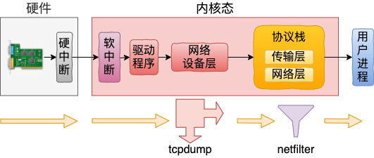

### 网络包接收



```
硬中断入口: e1000_intr或igb_msix_ring
软中断入口: ksoftirqd_should_run
驱动程序入口: n->poll，即是e1000e_poll或igb_poll
网络设备入口: napi_complete_done
网络层入口: pt_prev->func，即是ip_list_rcv
传输层入口: ipprot->handle，即是tcp_v4_rcv
```

#### 执行netfilter：PREROUTING、INPUT链
```
// 网络层入口
ip_list_rcv() {
  ip_sublist_rcv() {
    NF_HOOK_LIST(NFPROTO_IPV4, NF_INET_PRE_ROUTING, ...)
  }
  ip_sublist_rcv_finish() {
    ip_local_deliver() {
      NF_HOOK(NFPROTO_IPV4, NF_INET_LOCAL_IN, ...)
    }
  }
}
```

#### 执行tcpdump
```
// 在网络设备层
napi_complete_done {
  netif_receive_skb_list_internal() {
    __netif_receive_skb_list_core() {
      __netif_receive_skb_core(&skb, pfmemalloc, &pt_prev) {
        list_for_each_entry_rcu(ptype, &ptype_all, list) {
          deliver_skb(skb, pt_prev, orig_dev);
        }
      }
    }
  }
}
```


