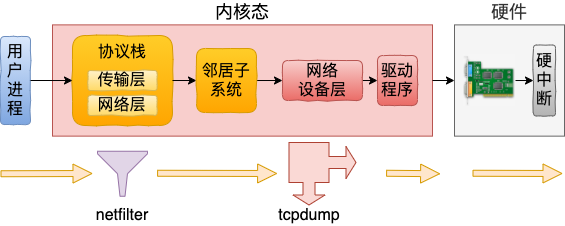

### 网络包发送



```
系统调用入口: sys_sendto
协议栈入口: sock->ops->sendmsg，AF_INET协议族是inet_sendmsg
传输层入口: sk->sk_prot->sendmsg，tcp是tcp_sendmsg
网络层入口: icsk->icsk_af_ops->queue_xmit，即是ip_queue_xmit
邻居系统入口: neigh_output
网络设备入口: dev_queue_xmit
驱动程序入口: dev->netdev_opsndo_start_xmit，可能是：
            e1000_xmit_frame
            igb_xmit_frame
```

#### 执行netfilter：OUTPUT、POSTOUTPUT链
```
// 在网络层
ip_queue_xmit() {
  __ip_queue_xmit() {
    ip_local_out() {
      __ip_local_out() {
        nf_hook(NFPROTO_IPV4, NF_INET_LOCAL_OUT, ...)
      }
      ip_output() {
        NF_HOOK_COND(NFPROTO_IPV4, NF_INET_POST_ROUTING, ...)
      }
    }
  }
}
```

#### 执行tcpdump
```
// 在网络设备层
dev_hard_start_xmit() {
  xmit_one(skb, dev, ...) {
    dev_queue_xmit_nit(skb, dev) {
      list_for_each_entry_rcu(ptype, ptype_list, list) {
        deliver_skb(skb2, pt_prev, skb->dev); // 执行 tcpdump 挂在上面的虚拟协议packet_rcv
      }
    }
  }
}

// tcpdump在启动时会执行socket(AF_PACKET, SOCK_RAW, ETH_P_ALL)
SYSCALL_DEFINE3(socket, int, family, int, type, int, protocol)
|-sock_create(family, type, protocol, &sock);
  |-pf = rcu_dereference(net_families[family]);
  |-pf->create(net, sock, protocol, kern);   // 即是packet_create
    |-packet_create(net, sock, protocol, kern)
      |-po = pkt_sk(sk);
      |-po->prot_hook.func = packet_rcv;     // 设置回调函数为packet_rcv
      |-register_prot_hook(sk);
        |-po = pkt_sk(sk);
        |-dev_add_pack(&po->prot_hook);
          |-head = ptype_head(pt)            // ptype_head函数检查pt->type == ETH_P_ALL则返回ptype_all
          |-list_add_rcu(&pt->list, head)
```

#### 发送和接收的时序图


