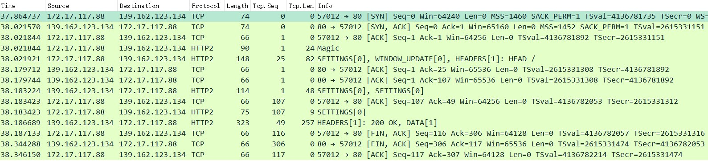

### http2协议

#### 参考文章
* [RFC 9113](https://www.rfc-editor.org/rfc/rfc9113.html)

```
HTTP Frame {
  Length (24),            // Frame Payload length
  Type (8),               // 0~9依次是DATA/HEADERS/PRIORITY/RST_STREAM/SETTINGS/PUSH_PROMISE/PING/GOAWAY/WINDOW_UPDATE/CONTINUATION
  Flags (8),              // stream类型不同代表的含义也不同
  Reserved (1),           // Reserved
  Stream Identifier (31), // Stream Id
  Frame Payload (..),     // Frame Payload
}
```

#### 网络抓包
```
// 发起不带tls的http2请求，用wireshark抓包如下图
curl --http2-prior-knowledge -I "http://nghttp2.org"

1. 客户端先发了2个包（共4个Frame），服务端响应2个ack：
Stream: Magic,         PRI * HTTP/2.0\r\n\r\nSM\r\n\r\n（固定24字节）
Stream: SETTINGS,      Stream ID: 0, Length 18
Stream: WINDOW_UPDATE, Stream ID: 0, Length 4
Stream: HEADERS,       Stream ID: 1, Length 33, HEAD /

2. 服务端发了2个包（共4个Frame），客户端响应2个ack
Stream: SETTINGS, Stream ID: 0, Length 30
Stream: SETTINGS, Stream ID: 0, Length 0
Stream: HEADERS,  Stream ID: 1, Length 239, 200 OK
Stream: DATA,     Stream ID: 1, Length 0
```




