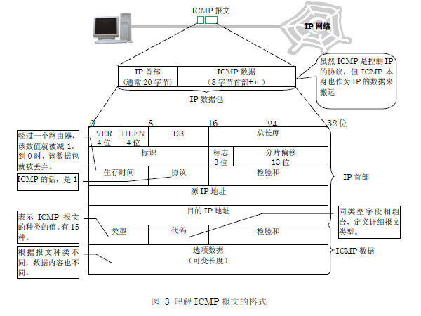
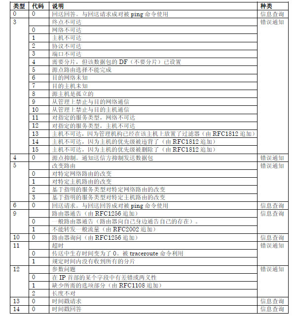

### icmp协议

#### 参考文章
* [RFC 792](https://datatracker.ietf.org/doc/html/rfc792)
* [how does linux nat a ping?](https://news.ycombinator.com/item?id=37455621)

#### how does linux nat a ping
```shell
# 1. windows上对 ping 1.1.1.1 进行抓包
src=192.168.2.119 dst=1.1.1.1 type=0x08 code=0x00 checksum=0x4d49 id=0x0001 seq=0x0012
src=192.168.2.119 dst=1.1.1.1 type=0x00 code=0x00 checksum=0x5549 id=0x0001 seq=0x0012

src=192.168.2.119 dst=1.1.1.1 type=0x08 code=0x00 checksum=0x4d48 id=0x0001 seq=0x0013
src=192.168.2.119 dst=1.1.1.1 type=0x00 code=0x00 checksum=0x5548 id=0x0001 seq=0x0013

src=192.168.2.119 dst=1.1.1.1 type=0x08 code=0x00 checksum=0x4d47 id=0x0001 seq=0x0014
src=192.168.2.119 dst=1.1.1.1 type=0x00 code=0x00 checksum=0x5547 id=0x0001 seq=0x0014

# 2. 使用strace跟踪ping命令的系统调用
socket(AF_INET, SOCK_RAW, IPPROTO_ICMP) = 3
setsockopt(3, SOL_RAW, ICMP_FILTER, ~(1<<ICMP_ECHOREPLY|1<<ICMP_DEST_UNREACH|1<<ICMP_SOURCE_QUENCH|1<<ICMP_REDIRECT|1<<ICMP_TIME_EXCEEDED|1<<ICMP_PARAMETERPROB), 4) = 0
setsockopt(3, SOL_IP, IP_RECVERR, [1], 4) = 0
setsockopt(3, SOL_SOCKET, SO_SNDBUF, [324], 4) = 0
setsockopt(3, SOL_SOCKET, SO_RCVBUF, [65536], 4) = 0
setsockopt(3, SOL_SOCKET, SO_TIMESTAMP, [1], 4) = 0
setsockopt(3, SOL_SOCKET, SO_SNDTIMEO, "\1\0\0\0\0\0\0\0\0\0\0\0\0\0\0\0", 16) = 0
setsockopt(3, SOL_SOCKET, SO_RCVTIMEO, "\1\0\0\0\0\0\0\0\0\0\0\0\0\0\0\0", 16) = 0
sendto(3, "\10\0\255a8=\0\1\300g\1e\0\0\0\0\216\300\3\0\0\0\0\0\20\21\22\23\24\25\26\27"..., 64, 0, {sa_family=AF_INET, sin_port=htons(0), sin_addr=inet_addr("1.1.1.1")}, 16) = 64
recvmsg(3, {
  msg_name={sa_family=AF_INET, sin_port=htons(0), sin_addr=inet_addr("1.1.1.1")}, 
  msg_namelen=128->16, 
  msg_iov=[{iov_base="E\0\0Tc\334\0\0004\1#1\1\1\1\1\254\31Q\201\0\0\265a8=\0\1\300g\1e"..., iov_len=192}], 
  msg_iovlen=1, 
  msg_control=[{cmsg_len=32, cmsg_level=SOL_SOCKET, cmsg_type=SCM_TIMESTAMP, cmsg_data={tv_sec=1694590912, tv_usec=385177}}], 
  msg_controllen=32, 
  msg_flags=0}, 0
) = 84


```



