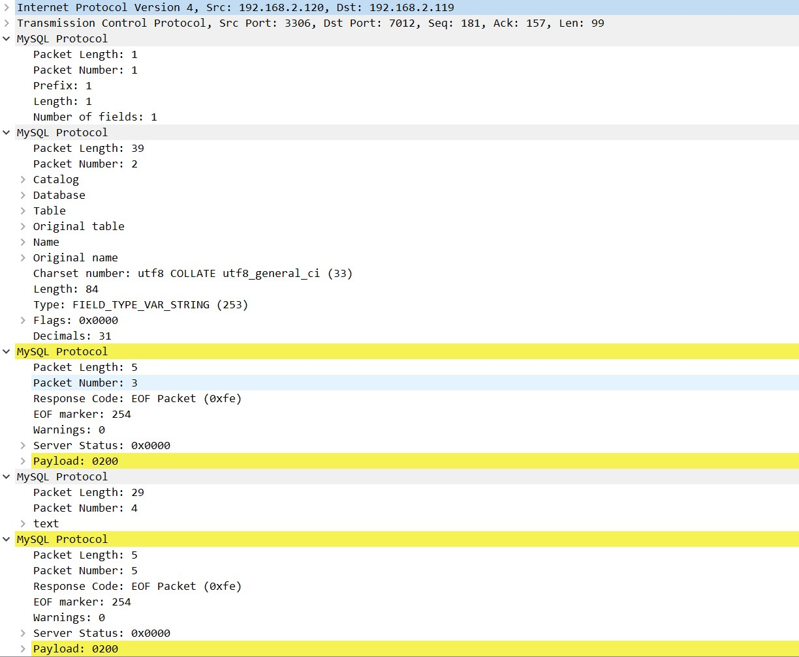

### mysql协议

#### 参考文章
* [MySQL网络协议分析](https://scala.cool/2017/11/mysql-protocol/)
* [Client/Server Protocol](https://dev.mysql.com/doc/dev/mysql-server/latest/PAGE_PROTOCOL.html#protocol_overview)

```
MySQL Protocal {
  payload_length (3),        // Payload length
  sequence_id (1),           // 默认是0，包大于16MB需要分包，从0开始增长
  payload (..),              // Payload
}

Client payload {
  type (1),                  // 0x01关闭连接 0x02切换数据库 0x03查询SQL ... 
  content (..),              // 具体内容
}

Server payload1 {            // ok包
  header (1),
  affected_rows (..),        // LengthEncodedInteger类型，1~9字节
  last_insert_id (..),       // LengthEncodedInteger类型，1~9字节
  status_flags (2),
  warnings (2),
  info (..)
}

Server payload2 {            // err包
  header (1),                // 0xff
  error_code (2),
  sql_state_marker (1),
  sql_state (5),
  error_message (..),
}

Server payload3 {            // eof包
  header (1),                // 0xfe
  warnings (2),
  status_flags (2),
}

Server ResultSet {           // ResultSet包，由多个MySQL Protocal包组成
  ResultSet Header,             
  Field,                     // 多个，数据列信息
  EOF,
  Row Data,                  // 多个，数据row信息
  EOF,
}
```

#### 网络抓包
```
// Client payload，发送sql：use godpan;
0c 00 00 00 03 75 73 65 20 67 6f 64 70 61 6e 3b   .....use godpan;

// Server payload1
07 00 00 00 00 00 00 02 00 00 00                  ...........

// Server payload2
22 00 00 01 ff 19 04 23 34 32 30 30 30 55 6e 6b   "......#42000Unk
6e 6f 77 6e 20 64 61 74 61 62 61 73 65 20 27 67   nown database 'g
6f 64 70 61 6e 27                                 odpan'

// Server payload3
05 00 00 01 fe 00 00 02 00                        .........

// Server ResultSet 见下图
```


