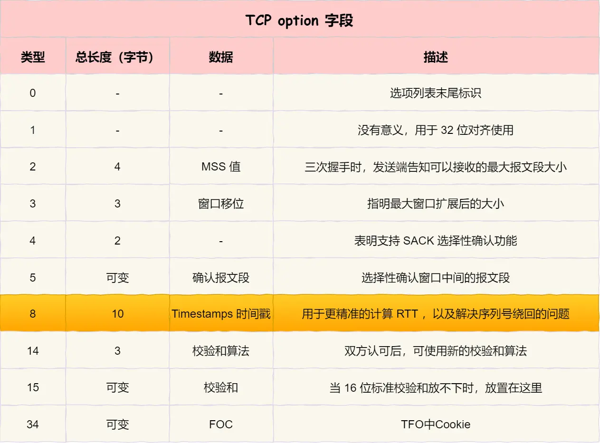

### tcp协议

#### 参考文章
* [rfc 791](https://www.rfc-editor.org/rfc/rfc9293)
* [既然IP层会分片，为什么TCP层也还要分段？](https://mp.weixin.qq.com/s/YpQGsRyyrGNDu1cOuMy83w)

```
    0                   1                   2                   3
    0 1 2 3 4 5 6 7 8 9 0 1 2 3 4 5 6 7 8 9 0 1 2 3 4 5 6 7 8 9 0 1
   +-+-+-+-+-+-+-+-+-+-+-+-+-+-+-+-+-+-+-+-+-+-+-+-+-+-+-+-+-+-+-+-+
   |          Source Port          |       Destination Port        |
   +-+-+-+-+-+-+-+-+-+-+-+-+-+-+-+-+-+-+-+-+-+-+-+-+-+-+-+-+-+-+-+-+
   |                        Sequence Number                        |
   +-+-+-+-+-+-+-+-+-+-+-+-+-+-+-+-+-+-+-+-+-+-+-+-+-+-+-+-+-+-+-+-+
   |                    Acknowledgment Number                      |
   +-+-+-+-+-+-+-+-+-+-+-+-+-+-+-+-+-+-+-+-+-+-+-+-+-+-+-+-+-+-+-+-+
   |  Data |       |C|E|U|A|P|R|S|F|                               |
   | Offset| Rsrvd |W|C|R|C|S|S|Y|I|            Window             |
   |       |       |R|E|G|K|H|T|N|N|                               |
   +-+-+-+-+-+-+-+-+-+-+-+-+-+-+-+-+-+-+-+-+-+-+-+-+-+-+-+-+-+-+-+-+
   |           Checksum            |         Urgent Pointer        |
   +-+-+-+-+-+-+-+-+-+-+-+-+-+-+-+-+-+-+-+-+-+-+-+-+-+-+-+-+-+-+-+-+
   |                           [Options]                           |
   +-+-+-+-+-+-+-+-+-+-+-+-+-+-+-+-+-+-+-+-+-+-+-+-+-+-+-+-+-+-+-+-+
   |                                                               :
   :                             Data                              :
   :                                                               |
   +-+-+-+-+-+-+-+-+-+-+-+-+-+-+-+-+-+-+-+-+-+-+-+-+-+-+-+-+-+-+-+-+

Src Port:              源始port
Dst Port:              目标port
Sequence Number:       Seq ID
Acknowledgment Number: Ack ID
Data Offset:           tcp头的长度，若值为8表示tcp头是8*4字节
Rsrvd:                 保留字段
CWR:                   Congestion Window Reduced
ECE:                   ECN-Echo
URG:                   Urgent pointer field is significant.
ACK:                   Acknowledgment field is significant.
PSH:                   Push function 
RST:                   Reset the connection.
SYN:                   Synchronize sequence numbers.
FIN:                   No more data from sender.
Window:                窗口大小
Checksum:              校验tcp头+应用数据
Urgent Pointer:        紧急指针，仅当URG=1时使用

（ACK字段除了第一次握手外，其他时刻都必须是1）
```



#### 三次握手四次挥手


#### TCP keepalive
|参数|socket级别设置|内核级别设置|说明|
|---|---|---|---|
|tcp_keepalive        | SO_KEEPALIVE | 只能在应用层设置             | 开启心跳检查|
|tcp_keepalive_time   | TCP_KEEPIDLE | net.ipv4.tcp_keepalive_time  | idle时多久发一次探测|
|tcp_keepalive_intvl  | TCP_KEEPINTVL| net.ipv4.tcp_keepalive_intvl | 无ack时多久发一次探测|
|tcp_keepalive_probes | TCP_KEEPCNT  | net.ipv4.tcp_keepalive_probes| 无ack时发几次探测|
