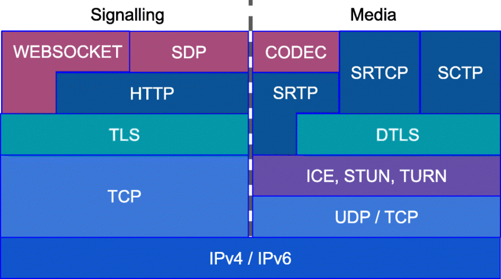

### webrtc协议

#### 参考文章
* [rfc](https://datatracker.ietf.org/wg/rtcweb/documents/)
* [给好奇者的 WebRTC](https://webrtcforthecurious.com/zh/)
* [浏览器W3C的 WebRTC](https://www.w3.org/TR/webrtc/)
* [webrtc的sdp的字段解释](https://webrtchacks.github.io/sdp-anatomy/)
* RFC 标准分如下几类：
  * ICE 协议相关部分，媒体描述，offer/answer 通信过程。
  * P2P 穿越相关部分，主要是 STUN/TURN。
  * DTLS 相关部分，主要是网络传输相关标准。
  * RTP/RTCP/SCTP，主要是多媒体传输相关标准。
* 音视频传输：
  * RTP传输流数据，基于UDP
  * RTCP传输控制元数据，基于UDP
  * （如果要加密传输，则通过DTLS加密成SRTP/SRTCP后传输）
* 应用数据传输：即datachannel
  * 传输SCTP包，基于UDP
  * （如果要加密传输，则通过DTLS加密后传输）

